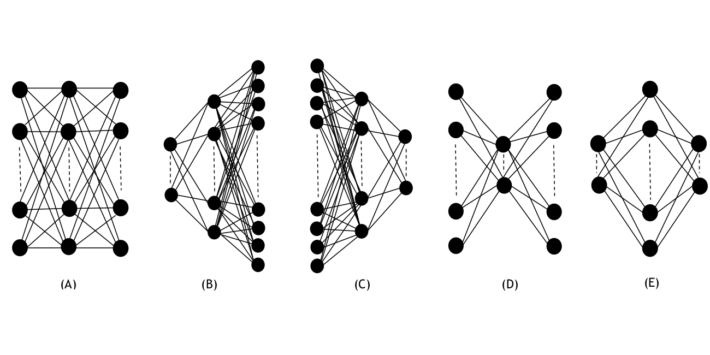
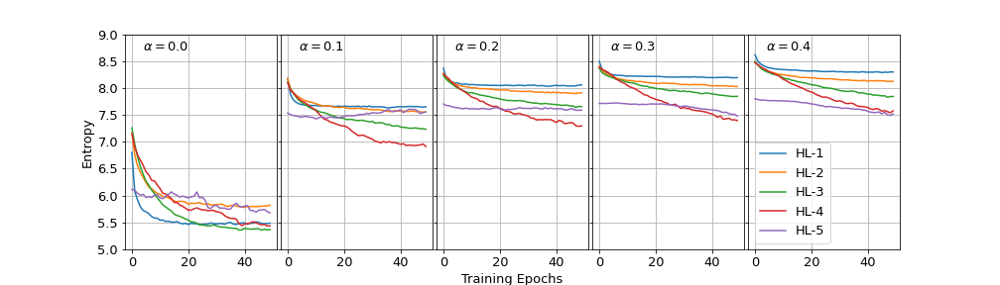

### Analysis Code for the Study: Effects of Nonlinearity and Network Architecture on the Performance of Supervised Neural Networks. 
Empirical study of the effects of nonlinearity in activation functions on the performance of deep learning models. We investigate the learning dynamics of hidden layers of shallow neural networks using entropy as a measurment of randomness in hidden layer outputs.

### Abstract:
 - The nonlinearity of activation functions used in deep learning models is crucial for the success of predictive models. Several simple nonlinear functions, including Rectified Linear Unit (ReLU) and Leaky-ReLU (L-ReLU) are commonly used in neural networks to impose the nonlinearity. In practice, these functions remarkably enhance the model accuracy. However, there is limited insight into the effects of nonlinearity in neural networks on their performance. Here, we investigate the performance of neural network models as a function of nonlinearity using ReLU and L-ReLU activation functions in the context of different model architectures and data domains. We use entropy as a measurement of the randomness, to quantify the effects of nonlinearity in different architecture shapes on the performance of neural networks. We show that the ReLU nonliearity is a better choice for activation function mostly when the network has sufficient number of parameters. However, we found that the image classification models with transfer learning seem to perform well with L-ReLU in fully connected layers. We show that the entropy of hidden layer outputs in neural networks can fairly represent the fluctuations in information loss as a function of nonlinearity. Furthermore, we investigate the entropy profile of shallow neural networks as a way of representing their hidden layer dynamics.

### This repository consists of following folders:
```diff
+(When you open .ipynb files, if you see the messege "Sorry, something went wrong. Reload", please use the nbviewer (https://nbviewer.jupyter.org/) to view the notebooks. Just copy the URL link to the notebook you want to view and paste it in the URL box in nbviewer.)
```
 - **Folder: Performance_vs_num_par**: The accuracy and loss calculated for different model architecturs using the MNIST data set as a function of linearity in the network. Both MNIST-digits and MNIST-fashion data sets were tested. Five model architecture shapes were tested by varing the number of parameters per layer (width). Following studies were performed;
   - Accuracy vs number of parameters for fixed architecture shape
   - Accuracy vs linearity of the network as a function of number of paramters
   - Accuracy vs linearity of the network as a function of network architecture shape
 - **Folder: performance_vs_data_domain**: Loss calculated based on different data domains and with/without transfer learning (TL).
   - Regression: Simulated data with 8, 16, 24 features
   - Classification (w/o TL): MNIST-fashion, MNIST-digits. EMNIST-letters
   - Classification (w TL): FOOD-11, Dog Breeds, cifar10
     - TL pre-trained models: VGG16, VGG19, Xception, InceptionV3, ResNet50
 - **Folder: Entropy**: Entropy calculation for each layer and its variations under different nonlinearities and model architectures. Following studies were performed and two data sets (MNIST-digits, MNIST-fashion) were tested.
   - Entropy profile of hidden layers as a function of nonlinearity in the network
   - Entropy profile of hidden layres as a function of model architecture
 
 ### Data used for the analysis:
 - **MNIST hand written digits**: http://yann.lecun.com/exdb/mnist/
 - **FOOD-11 data set**: https://www.kaggle.com/vermaavi/food11
 - **DOG breeds data set**: contact cor. author
 - **cifar10 data set**: https://www.cs.toronto.edu/~kriz/cifar.html
 - **MNIST fashion data set**: https://www.kaggle.com/zalando-research/fashionmnist
 - **EMNIST letters data set**: https://www.nist.gov/itl/products-and-services/emnist-dataset
 
 ### GPU
 - **NVIDIA DGX-2:** NVIDIA Tesla V100 (512 GB/node)
 
 ### Network architecture shapes used in the analysis:
 
 
 ### Sample Result: Entropy vs Linearity in the network (preliminary)
 - Entropy profile for the 5 layer neural network during the training process as a function of linearity factor (&alpha;). Linearity factor in L-ReLU was changed    from &alpha; = 0.0 to &alpha; = 0.4. Hidden layers 1-5 of the neural network consist of nodel combinations; 256, 128, 128, 128 and 32, respectively. These models were trained using 60,000 MNIST-digits images with 33% validation split.
 
 
  
 **Any questions, please contact**: Nalinda Kulathunga (Nalinda.Kulathunga@tsu.edu)
